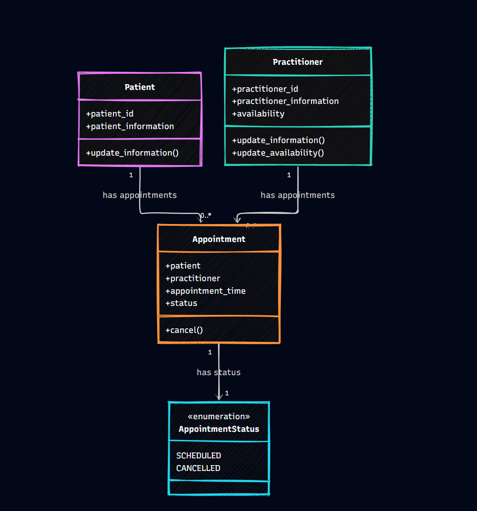

# SmartCare v0.3 Domain Modelling Lab

## Purpose

This lab takes the SmartCare v0.2 requirements and turns them into an object-oriented domain model.

The aim is to identify the main domain concepts, their responsibilities and their relationships before implementing the full behaviour in Stage 4.

---

## A. Requirements Review

The SmartCare v0.2 requirements were reviewed to identify important nouns, verbs and business rules.

### Nouns and Concepts

The main nouns and concepts identified were:

- Patient
- Practitioner
- Appointment
- Patient information
- Practitioner information
- Practitioner availability
- Appointment time
- Appointment status
- Appointment history
- Patient identifier
- Practitioner identifier
- Operational reporting
- Clinic staff

### Verbs and Behaviours

The main actions identified were:

- Create patient records
- Search for patient records
- Update patient information
- Create practitioner records
- Maintain practitioner information
- Record practitioner availability
- Update practitioner availability
- View scheduled appointments
- Create appointments
- View appointment details
- Prevent duplicate bookings
- Cancel appointments
- Retain cancelled appointments
- Retrieve appointment information

### Business Rules

The main business rules identified from the requirements were:

1. An appointment is associated with one patient.
2. An appointment is associated with one practitioner.
3. A patient can have zero or many appointments.
4. A practitioner can have zero or many appointments.
5. A practitioner cannot have two appointments at the same time.
6. A cancelled appointment must remain in appointment history.
7. An appointment has a status.
8. The exact appointment status rules are not fully defined in the case study.
9. The exact practitioner availability rules are also not fully defined.

---

## B. Candidate Classes

The candidate concepts were reviewed against the SmartCare v0.2 requirements.

| Candidate Concept | Class? | Supporting Requirement | Reason |
|---|---|---|---|
| Patient | Yes | FR-01, FR-02, FR-03 | Patient records have their own information and behaviour. |
| Practitioner | Yes | FR-04, FR-05, FR-06 | Practitioners have information, availability and scheduled appointments. |
| Appointment | Yes | FR-07 to FR-12 | Appointments have their own information, status and behaviour. |
| Name | No | FR-01, FR-04 | A name is information belonging to a Patient or Practitioner rather than a separate domain object. |
| Clinic | No | Case study context | The requirements do not give Clinic its own state or responsibilities. |
| Database | No | No confirmed FR | A database is an implementation concern rather than a domain concept required by the confirmed requirements. |
| Cancellation | No | FR-10, FR-11 | Cancellation is an action or state change involving an Appointment rather than a separate object. |
| Status | No | FR-09, FR-10, FR-11 | Status belongs to Appointment. It is represented as `AppointmentStatus` in the design rather than as a separate domain class. |

### Selected Domain Concepts

The main domain classes are:

- `Patient`
- `Practitioner`
- `Appointment`

`AppointmentStatus` is represented as an enumeration because appointment status is part of the Appointment state.

Classes such as managers, controllers, notification services and scheduling engines were not added because they are not required by the confirmed domain requirements.

---

## C. CRC Cards

CRC means Class, Responsibilities and Collaborators.

### Patient

**Class:** `Patient`

**Responsibilities:**

- Represent a patient record.
- Store the patient identifier.
- Store required patient information.
- Support updating patient information.

**Collaborators:**

- `Appointment`

**Supporting requirements:**

- FR-01
- FR-02
- FR-03

### Practitioner

**Class:** `Practitioner`

**Responsibilities:**

- Represent a practitioner record.
- Store the practitioner identifier.
- Store required practitioner information.
- Represent practitioner availability.
- Support updating practitioner information and availability.

**Collaborators:**

- `Appointment`

**Supporting requirements:**

- FR-04
- FR-05
- FR-06

### Appointment

**Class:** `Appointment`

**Responsibilities:**

- Represent an appointment.
- Associate a patient with an appointment.
- Associate a practitioner with an appointment.
- Store the appointment time.
- Store the appointment status.
- Represent appointment cancellation.
- Retain the appointment as part of appointment history.

**Collaborators:**

- `Patient`
- `Practitioner`

**Supporting requirements:**

- FR-07
- FR-08
- FR-09
- FR-10
- FR-11
- FR-12

---

## D. UML Class Diagram

The UML diagram represents the approved domain model. It includes the classes, attributes, operations, associations and multiplicities.

### Main Relationships

A Patient can have zero or many appointments, while each Appointment is associated with one Patient.

`Patient "1" -------- "0..*" Appointment`

A Practitioner can have zero or many appointments, while each Appointment is associated with one Practitioner.

`Practitioner "1" -------- "0..*" Appointment`

The UML diagram is stored separately as `uml.png`.

## E. AI Design Review

AI was used as a design reviewer after the initial domain model was developed.

The purpose of the review was to identify possible classes and relationships using only the confirmed SmartCare requirements.

The AI was instructed not to invent new requirements and to support suggestions with requirement IDs.

### AI Review Prompt

The following prompt was used:

> Review the proposed SmartCare v0.3 domain model using only the confirmed requirements FR-01 to FR-12.
>
> Identify possible domain classes, responsibilities and relationships.
>
> Do not invent new requirements or features.
>
> For every suggestion, identify the supporting requirement ID.
>
> The current proposed domain concepts are Patient, Practitioner, Appointment and AppointmentStatus.
>
> Also consider whether PatientManager, PractitionerManager, AppointmentManager, ClinicController, NotificationManager or ScheduleEngine are justified by the confirmed requirements.
>
> Explain the evidence for each suggestion so that the design decision can be reviewed.
>
> Confirmed requirements:
>
> FR-01: The system shall allow clinic staff to create a patient record containing the required patient information.
>
> FR-02: The system shall allow clinic staff to search for a patient record using a patient identifier.
>
> FR-03: The system shall allow clinic staff to update patient information stored in a patient record.
>
> FR-04: The system shall allow clinic staff to create and maintain practitioner records containing the required practitioner information.
>
> FR-05: The system shall allow clinic staff to record and update practitioner availability.
>
> FR-06: The system shall allow practitioners to view their scheduled appointments.
>
> FR-07: The system shall allow clinic staff to create an appointment by selecting a patient, practitioner and appointment time.
>
> FR-08: The system shall prevent an appointment from being created when the selected practitioner is already booked for the same appointment time.
>
> FR-09: The system shall allow clinic staff to view appointment details, including the patient, practitioner, appointment time and appointment status.
>
> FR-10: The system shall allow clinic staff to cancel a scheduled appointment.
>
> FR-11: The system shall retain cancelled appointments in the appointment history rather than deleting them.
>
> FR-12: The system shall allow clinic staff to retrieve appointment information for basic operational reporting.

### Review Approach

The AI suggestions were compared with the requirements and the existing domain model.

An AI suggestion was only considered appropriate when there was evidence in the confirmed requirements.

## F. Compare and Decide

The AI suggestions were reviewed and decisions were made based on the confirmed requirements.

| AI Suggestion | Evidence | Decision | Reason |
|---|---|---|---|
| `AppointmentStatus` can represent the appointment state. | FR-09, FR-10 and FR-11 require appointment status to be recorded and changed when an appointment is cancelled. | Accepted | Representing the status as an enumeration keeps the appointment state clear without creating another domain class. |
| `AppointmentManager` could handle appointment creation and duplicate booking checks. | FR-07 and FR-08 require appointment creation and prevention of duplicate practitioner bookings. | Modified | The required behaviour is accepted, but a separate `AppointmentManager` class was not added because it is not required by the confirmed requirements. |
| `PatientManager` should manage patient records. | FR-01, FR-02 and FR-03 require patient records to be created, searched and updated. | Rejected | The requirements support the `Patient` domain concept but do not require a separate manager class. |
| `PractitionerManager` should manage practitioner information and availability. | FR-04 and FR-05 require practitioner information and availability to be managed. | Rejected | A separate manager class is not supported by the requirements. |
| `NotificationManager` could handle appointment reminders. | No confirmed requirement supports appointment notifications. | Rejected | Adding notifications would introduce functionality outside the confirmed scope. |
| `ScheduleEngine` could manage appointment scheduling. | FR-05 and FR-08 mention availability and duplicate booking prevention. | Rejected | The requirements do not establish a separate scheduling engine as a domain concept. |

### Design Decision

The final model remains focused on:

- `Patient`
- `Practitioner`
- `Appointment`
- `AppointmentStatus`

The AI suggestions were used to review the model, but the requirements remained the basis for the final design decisions.

## G. Python Skeletons

The approved domain model was represented in `smartcare_skeleton_week6.py`.

The Python file contains skeletons for:

- `Patient`
- `Practitioner`
- `Appointment`
- `AppointmentStatus`

The class structure and attributes are intended to match the UML diagram.

The Python file only contains class structure, method signatures and minimal placeholders.

Full behaviour is deliberately not implemented at this stage.

The following are left for Stage 4:

- booking logic
- duplicate booking checks
- detailed validation
- appointment status transitions
- practitioner availability checking
- database implementation
- reporting logic

The purpose of the Stage 3 code is to demonstrate that the proposed domain structure can be represented in Python.

## H. Consistency Check

The Python skeleton was checked against the UML model.

| UML Element | Python Element | Result |
|---|---|---|
| `Patient` class | `class Patient` | Consistent |
| `Practitioner` class | `class Practitioner` | Consistent |
| `Appointment` class | `class Appointment` | Consistent |
| `AppointmentStatus` | `AppointmentStatus` enumeration | Consistent |
| Patient identifier | Patient identifier attribute | Consistent |
| Patient information | Patient information attribute | Consistent |
| Practitioner identifier | Practitioner identifier attribute | Consistent |
| Practitioner information | Practitioner information attribute | Consistent |
| Practitioner availability | Practitioner availability attribute | Consistent |
| Appointment patient | Appointment patient attribute | Consistent |
| Appointment practitioner | Appointment practitioner attribute | Consistent |
| Appointment time | Appointment time attribute | Consistent |
| Appointment status | Appointment status attribute | Consistent |

The UML and Python structure were kept consistent.

The Python skeleton is intended to run without errors. The execution evidence is stored in `run_output.txt`.

## Reflection

### What modelling decision was hardest?

The hardest modelling decision was deciding whether additional classes were needed for appointment management and scheduling.

The requirements clearly describe appointment creation and duplicate booking prevention, but they do not require separate manager or scheduling classes.

The model was therefore kept focused on the main domain concepts and the detailed business logic was left for Stage 4.

### Where did AI over-design?

The AI over-designed the system when it suggested additional classes such as `PatientManager`, `PractitionerManager`, `AppointmentManager`, `NotificationManager` and `ScheduleEngine`.

Some of these classes could be useful in a larger application, but the confirmed SmartCare requirements do not establish them as domain concepts.

The notification suggestion was particularly outside the confirmed scope because there is no requirement for SMS, email or appointment reminders.

### What evidence supported the final choices?

The final choices were based on the SmartCare v0.2 requirements and the requirement IDs FR-01 to FR-12.

The main evidence was:

- FR-01 to FR-03 support `Patient`.
- FR-04 to FR-06 support `Practitioner`.
- FR-07 to FR-12 support `Appointment`.
- FR-09 to FR-11 support appointment status.
- FR-07 supports the relationships between `Appointment` and the selected `Patient` and `Practitioner`.
- FR-08 supports the business rule preventing a practitioner from having two appointments at the same time.
- The absence of requirements for notifications, databases, controllers and scheduling engines supports excluding those concepts from the domain model.

The final model was also checked against the Python skeleton so that the implementation structure follows the UML design.

