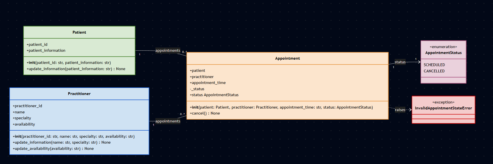

# SmartCare v0.4 - Implementation

## 1. UML-to-Code Trace

The Python implementation was checked against the approved Stage 3 UML and the Stage 4 implementation requirements.

| UML element | Python element | Implemented? | Notes |
|---|---|---|---|
| `Patient` class | `class Patient` | Yes | Implemented as a domain class. |
| `Patient.patient_id` | `self.patient_id` | Yes | Stores the patient identifier and is validated when the object is created. |
| `Patient.patient_information` | `self.patient_information` | Yes | Stores the required patient information and is updated through `update_information()`. |
| `Patient.update_information()` | `def update_information(...)` | Yes | Updates patient information after validating the new value. |
| `Practitioner` class | `class Practitioner` | Yes | Implemented as a domain class. |
| `Practitioner.practitioner_id` | `self.practitioner_id` | Yes | Stores the practitioner identifier and is validated when the object is created. |
| `Practitioner.name` | `self.name` | Yes | Represents the practitioner's name as required by the Week 7 lab. |
| `Practitioner.specialty` | `self.specialty` | Yes | Represents the practitioner's specialty as required by the Week 7 lab. |
| `Practitioner.availability` | `self.availability` | Yes | Retained from the Stage 3 model because FR-05 requires practitioner availability. |
| `Practitioner.update_information()` | `def update_information(...)` | Yes | Updates the practitioner's name and specialty after validation. |
| `Practitioner.update_availability()` | `def update_availability(...)` | Yes | Updates practitioner availability after validation. |
| `Appointment` class | `class Appointment` | Yes | Implemented as a domain class. |
| `Appointment.patient` | `self.patient` | Yes | Stores the associated Patient object. |
| `Appointment.practitioner` | `self.practitioner` | Yes | Stores the associated Practitioner object. |
| `Appointment.appointment_time` | `self.appointment_time` | Yes | Stores the appointment time. |
| `Appointment.status` | private `self._status` and read-only `status` property | Yes | Status is protected from direct public assignment. |
| `Appointment.cancel()` | `def cancel()` | Yes | Changes a scheduled appointment to cancelled. |
| `AppointmentStatus` | `class AppointmentStatus(Enum)` | Yes | Represents the appointment status values `SCHEDULED` and `CANCELLED`. |
| Patient to Appointment association | `Appointment.patient` | Yes | Each Appointment stores one Patient object. |
| Practitioner to Appointment association | `Appointment.practitioner` | Yes | Each Appointment stores one Practitioner object. |
| Appointment to AppointmentStatus | `Appointment.status` | Yes | Each Appointment has one current status. |

The implementation uses the same main domain concepts as the Stage 3 model. The Practitioner attributes were refined to include `name` and `specialty` because the Week 7 lab explicitly specifies them. Availability was retained because it is supported by FR-05.

---

## 2. Domain Invariants

An invariant is a rule that should remain true for an object while it is in a valid state.

| Class | Invariant or rule | How protected |
|---|---|---|
| `Patient` | The patient identifier is required and cannot be empty. | The constructor validates `patient_id` before storing it. |
| `Patient` | Patient information is required and cannot be empty. | The constructor and `update_information()` validate the value before changing the state. |
| `Practitioner` | The practitioner identifier, name and specialty must contain required values. | The constructor validates each required value before creating the object. |
| `Practitioner` | Practitioner availability must contain a value when supplied or updated. | The constructor and `update_availability()` validate the availability value. |
| `Appointment` | Appointment status can only change through the allowed domain operation. | Status is stored in private `_status` state and exposed through a read-only `status` property. |
| `Appointment` | A cancelled appointment cannot be cancelled again. | `cancel()` checks the current status and raises `InvalidAppointmentStateError` if it is already cancelled. |
| `Appointment` | An appointment must be created with a valid `AppointmentStatus`. New appointments are created as `SCHEDULED` by the calling code. | The constructor rejects any value that is not an `AppointmentStatus`. The initial value is supplied by the caller rather than defaulted, so that Stage 4 does not assume the full set of statuses, which Stage 2 recorded as an open question. |

These invariants make the Stage 4 encapsulation requirements concrete. The classes do not simply store data. They also protect important parts of their own state.

---

## 3. Composition / Inheritance Decisions

| Relationship | Decision | Rationale |
|---|---|---|
| `Appointment` ↔ `Patient` | Association | An Appointment is linked to a Patient, but an Appointment is not a type of Patient. |
| `Appointment` ↔ `Practitioner` | Association | An Appointment is linked to a Practitioner, but an Appointment is not a type of Practitioner. |
| `Doctor` ↔ `Practitioner` | Inheritance | A Doctor is a type of Practitioner, so inheritance would be appropriate if Doctor were introduced into the model. |
| `Clinic` ↔ `Appointment` | Association | A Clinic and an Appointment would be separate concepts. The confirmed requirements do not require a Clinic class or an ownership hierarchy. |
| `Appointment` ↔ `AppointmentStatus` | Association / enum relationship | Appointment has a status represented by the `AppointmentStatus` enumeration. The enum represents possible status values rather than being a parent class of Appointment. |

The implementation does not introduce inheritance between the existing SmartCare classes. The relationships between Patient, Practitioner and Appointment remain consistent with the Stage 3 model.

---

## 4. AI Pair-Programming Record

AI was used only for the Appointment implementation in Step D of the lab. Patient and Practitioner were implemented manually with AI OFF.

| AI contribution | Conforms? | Decision | Reason | Verification |
|---|---|---|---|---|
| Initial Appointment class structure | Yes | Accepted | It matched the approved Appointment concept and used the required patient, practitioner and appointment time information. | Compared the class structure with the approved UML. |
| `AppointmentStatus` enum | Yes | Accepted | The Stage 3 model already represented appointment status using an enumeration. | Checked that the enum contains the agreed `SCHEDULED` and `CANCELLED` values. |
| Private appointment status | Yes | Accepted | Protected status was specifically required by the Stage 4 handout. | Checked that status is stored using `_status` and exposed through a read-only property. |
| `cancel()` state transition | Yes, after review | Modified where necessary | Cancellation needs to change a scheduled appointment to cancelled and reject a second cancellation. | Created a scheduled appointment, called `cancel()`, checked the status, then called `cancel()` again and checked for `InvalidAppointmentStateError`. |
| Additional application dependencies | No | Rejected | Database, UI, notification and service classes were outside the approved scope. | Reviewed the imports and class definitions and removed unsupported dependencies. |

The AI contribution was treated as a starting point for pair programming rather than as code that could be accepted without review. The final implementation was checked against the UML, requirements and manual behaviour tests.

---

## 5. Updated UML

The Stage 4 implementation revealed a justified change to the Stage 3 UML.

### Practitioner design change

The Stage 3 model used:

- `practitioner_id`
- `practitioner_information`
- `availability`

The Week 7 lab specifically requires the Practitioner implementation to include an identifier, name and specialty. The Stage 4 implementation therefore changed `practitioner_information` into two separate attributes:

- `name`
- `specialty`

The `availability` attribute was retained because FR-05 requires the system to record and update practitioner availability.

The resulting Practitioner structure is:

- `practitioner_id`
- `name`
- `specialty`
- `availability`

This change makes the practitioner information more specific while still supporting the confirmed requirement for practitioner availability.

### Appointment status change

The Stage 4 implementation also made the protection of appointment status explicit.

The internal status is stored as the private `_status` attribute and is exposed through a read-only `status` property. The `cancel()` operation is the only operation that changes the status.

A custom `InvalidAppointmentStateError` was also added to represent an illegal attempt to cancel an appointment that is already cancelled.

This reflects the Stage 4 requirement for protected state transitions and does not introduce a new SmartCare domain concept.

### Updated diagram

The updated UML is stored as:

The updated diagram reflects the actual Stage 4 Python implementation, including:

- the revised Practitioner attributes
- protected Appointment status
- the read-only `status` property
- `AppointmentStatus`
- `InvalidAppointmentStateError`
- the existing Patient, Practitioner and Appointment relationships

No other changes were made to the approved domain relationships.